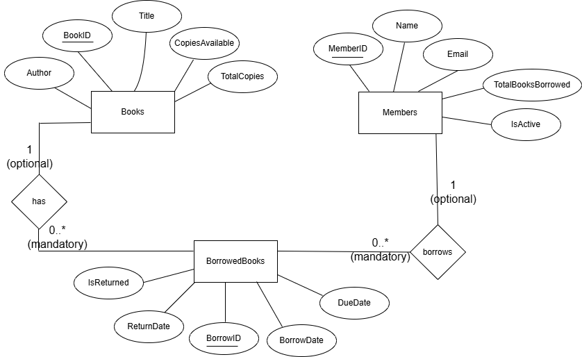
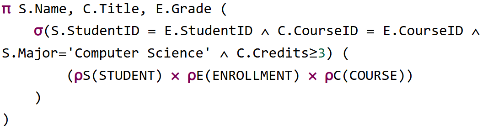
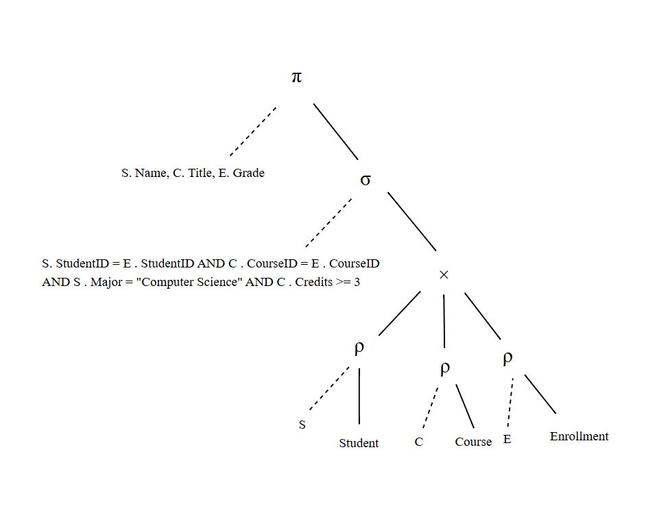
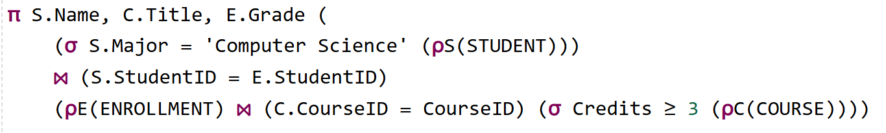

# Library Management Mini Project

## Task 1: Library Management System

### Part 1: Enhanced Requirements Analysis & ERD Design

### ERD


### Part 2: SQL Implementation Tasks
```sql
create table Books (
    BookID INT PRIMARY KEY,
    Title NVARCHAR(255),
    Author NVARCHAR(255),
    CopiesAvailable INT,
    TotalCopies INT
);

create table Members (
    MemberID INT PRIMARY KEY,
    Name NVARCHAR(255),
    Email NVARCHAR(255),
    TotalBooksBorrowed INT DEFAULT 0,
    IsActive BIT
);

create table BorrowedBooks (
    BorrowID INT IDENTITY(1,1) PRIMARY KEY,
    MemberID INT,
    BookID INT,
    BorrowDate DATE,
    DueDate DATE,
    ReturnDate DATE NULL,
    IsReturned BIT,
    FOREIGN KEY (MemberID) REFERENCES Members(MemberID),
    FOREIGN KEY (BookID) REFERENCES Books(BookID)
);
GO

CREATE PROCEDURE BorrowBook
    @member_ID INT,
    @book_ID INT
AS
BEGIN
    declare @active BIT;
    declare @copies INT;

    select @active = IsActive from Members where MemberID = @member_ID;

    select @copies = CopiesAvailable from Books where BookID = @book_ID;

    if @active = 0
    BEGIN
        RAISERROR ('member is not active', 16, 1);
        RETURN;
    END

    if @copies <= 0
    BEGIN
        RAISERROR ('no available copies', 16, 1);
        RETURN;
    END

    insert into BorrowedBooks (MemberID, BookID, BorrowDate, DueDate, IsReturned)
    values (@member_ID, @book_ID, GETDATE(), DATEADD(DAY, 7, GETDATE()), 0);

    update Members
    set TotalBooksBorrowed = TotalBooksBorrowed + 1
    where MemberID = @member_ID;

	update Books
    set CopiesAvailable = CopiesAvailable - 1
    where BookID = @book_ID;
END
GO

CREATE INDEX idx_books ON Books(BookID);
CREATE INDEX idx_members ON Members(MemberID);

GO
CREATE FUNCTION GetBooksBorrowed (@member_ID INT)
RETURNS INT
AS
BEGIN
    declare @counter INT;
    select @counter = COUNT(*)
    from BorrowedBooks
    where MemberID = @member_ID AND IsReturned = 0;
    RETURN @counter;
END
GO

CREATE TRIGGER PreventBorrowIfNoCopies
ON BorrowedBooks
INSTEAD OF INSERT
AS
BEGIN
    declare @copies INT;
    declare @active BIT;
    declare @member_ID INT;
    declare @book_ID INT;

    select top 1 @member_ID = MemberID, @book_ID = BookID from inserted;

    select @copies = CopiesAvailable from Books where BookID = @book_ID;

    if @copies <= 0
    BEGIN
        RAISERROR ('sorryyy we have no copies', 16, 1);
        RETURN;
    END

	select @active = IsActive from Members where MemberID = @member_ID;

    if @active = 0
    BEGIN
        RAISERROR ('you are not activeee', 16, 1);
        RETURN;
    END

    insert into BorrowedBooks (MemberID, BookID, BorrowDate, DueDate, ReturnDate, IsReturned)
    select MemberID, BookID, BorrowDate, DueDate, ReturnDate, IsReturned
    from inserted;
END
GO

insert into Books values (1, '2000', 'Book 1', 4, 5);
insert into Books values (2, '2001', 'Book 2', 0, 2);
insert into Books values (3, '2002', 'Book 3', 1, 3);

insert into Members values (1, 'Malak', 'malak@email.com', 2, 0);
insert into Members values (2, 'Menna', 'menna@email.com', 1, 1);
insert into Members values (3, 'Mohammed', 'mohammed@email.com', 0, 1);

EXEC BorrowBook 1, 1;
EXEC BorrowBook 1, 2;
EXEC BorrowBook 3, 2;
EXEC BorrowBook 2, 1; 
EXEC BorrowBook 3, 3;

select * from BorrowedBooks
```

BookID and MemberID are the best fields for indexing because they are the primary key, which means they are unique and sorted serially (avoiding collaps and wrong/duplicate selections)

## Task 2: SQL to Relational Algebra

### SQL Query

```sql
SELECT S.Name, C.Title, E.Grade
FROM STUDENT S, COURSE C, ENROLLMENT E
WHERE S.StudentID = E.StudentID
  AND C.CourseID = E.CourseID
  AND S.Major = 'Computer Science'
  AND C.Credits >= 3;
```

### Initial Relational Algebra Expression

```
π S.Name, C.Title, E.Grade (
    σ(S.StudentID = E.StudentID ∧ C.CourseID = E.CourseID ∧ S.Major='Computer Science' ∧ C.Credits≥3) (
        (ρS(STUDENT) ⨯ ρE(ENROLLMENT) ⨯ ρC(COURSE))
    )
)
```



### Query Tree Representation



### Optimized Relational Algebra (using heuristic optimizations)

1. Joins (⨝) instead of cross product (⨯): smaller intermediate results and faster
2. Apply selections early before joins: faster than full table joins
2. Apply projection after joins: less memory
```
π S.Name, C.Title, E.Grade (
    (σ S.Major = 'Computer Science' (ρS(STUDENT)))
    ⨝ (S.StudentID = E.StudentID)
    (ρE(ENROLLMENT) ⨝ (C.CourseID = CourseID) (σ Credits ≥ 3 (ρC(COURSE))))
)
```




